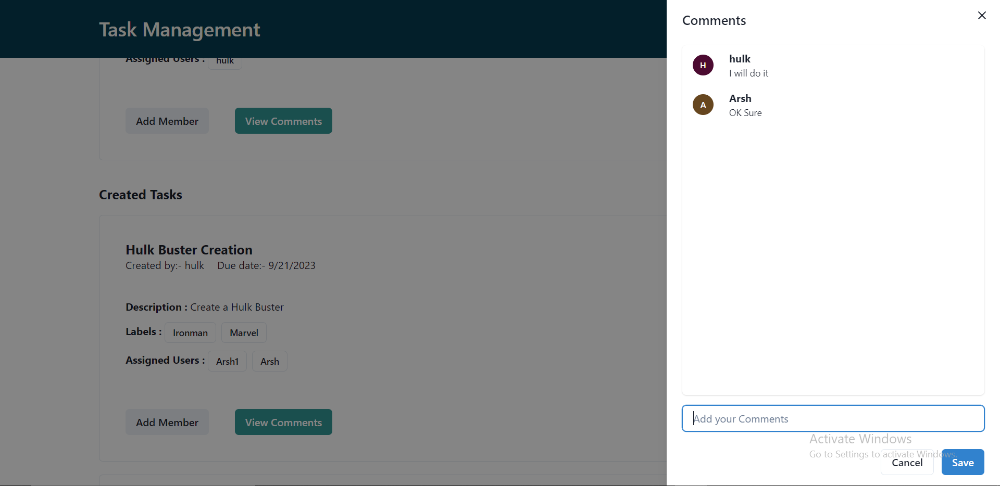

# Task-Management

Functionality:

1. Login and Sign Up
2. Create a task
3. Add members to it and assign to other users.
4. List all my tasks created by me or other users.
5. Add Comments on the tasks

Routes

# Screenshots

**Default page**

**Authorization:-** filling credentials in login page for passing the jwt authorization

**Sign Up page:-** Sign up page

**Home Page:-** Home page with assigned and created tasks

**Create a task:-** Create a task with all the labels and checklists

**Add a Member and assign to other users:-** Assign to other users and add a team member

**Add Comments** Add commments in a particular task from assigned users or user who have created it.

I have Chakra UI for building this website
